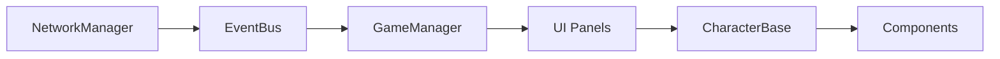

# 客户端开发待办清单

> 更新日期: 2026-05-11
> 状态: 规划中

---

## 优先级 P0 - 基础连接

| 任务 | 状态 | 说明 |
|------|------|------|
| [ ] 更新 NetworkManager 适配新 API | 待办 | 对齐 server/src/index.js 的 action 格式 |
| [ ] 实现 WebSocket 重连逻辑 | 待办 | 服务端断开后自动重连 |
| [ ] 添加连接状态 UI 指示器 | 待办 | 连接中/已连接/断开 |
| [ ] 实现玩家 ID 生成/存储 | 待办 | 首次启动生成 UUID 并持久化 |

---

## 优先级 P1 - 核心功能

| 任务 | 状态 | 说明 |
|------|------|------|
| [ ] 角色列表展示 | 待办 | CharacterPanel |
| [ ] 角色详情面板 | 待办 | 技能/装备/疲劳状态 |
| [ ] 皮肤切换功能 | 待办 | set_skin API |
| [ ] 工作指派界面 | 待办 | 选择角色 + 操作 + 区域 |
| [ ] 工作进度展示 | 待办 | 使用现有 WorkComponent |
| [ ] 工作奖励收集 | 待办 | collect_work API |
| [ ] 金币/库存 UI | 待办 | 顶部状态栏 |

---

## 优先级 P2 - 经营管理

| 任务 | 状态 | 说明 |
|------|------|------|
| [ ] 设施列表展示 | 待办 | ManagementPanel |
| [ ] 设施升级 UI | 待办 | build API (TODO in server) |
| [ ] 采集区域选择 | 待办 | 8 级区域选择器 |
| [ ] 采集模式切换 | 待办 | 单采/混合模式 |
| [ ] 工作队列管理 | 待办 | 队列最多 5 个 |

---

## 优先级 P3 - 地牢系统

| 任务 | 状态 | 说明 |
|------|------|------|
| [ ] 地牢面板 UI | 待办 | DungeonPanel |
| [ ] 角色派遣 | 待办 | enter_dungeon API (需服务端实现) |
| [ ] 地牢进度展示 | 待办 | 层数/敌人 |
| [ ] 战斗结算 | 待办 | 奖励展示 |

---

## 优先级 P4 - 离线/存档

| 任务 | 状态 | 说明 |
|------|------|------|
| [ ] 本地存档系统 | 待办 | 缓存服务端状态 |
| [ ] 离线奖励展示 | 待办 | offline_rewards 推送 |
| [ ] 重新连接同步 | 待办 | 对比本地 vs 服务端 |

---

## 已知问题

1. **服务端 TODO**:
   - `WorkSystem.js` 区域数据尚未完全实现
   - `onPlayerOnline` 离线计算未完成
   - WebSocket 推送 `work_complete` 未实现

2. **客户端 TODO**:
   - `WorkManager._load_work_type_definitions()` 未实现
   - `ManagementPanel` 设施条目动态创建未完成
   - `CharacterPanel` / `DungeonPanel` 需要完整实现

---

## 开发依赖

**开发顺序**:
1. NetworkManager 适配新 API
2. GameManager 状态管理
3. CharacterPanel (角色列表)
4. ManagementPanel (工作指派)
5. DungeonPanel (地牢)
6. 离线/存档系统
